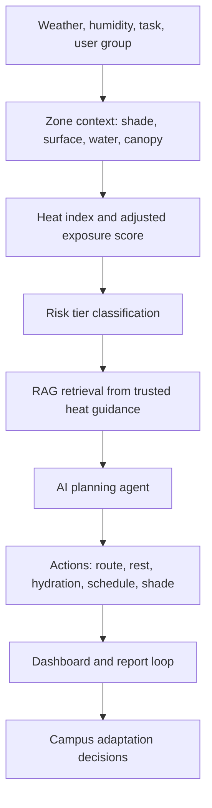

# ThermaRoute AI Project Report

## Title

**ThermaRoute AI: Thermal-Equity Copilot for Climate-Resilient Campuses**

## Abstract

ThermaRoute AI is an AI-centered sustainability project designed to reduce the risk of extreme heat exposure in campus and urban micro-environments. While many climate projects focus on broad weather forecasting, ThermaRoute AI addresses a more specific and underrepresented problem: the difference between official temperature alerts and the actual heat felt by people walking, waiting, working, or maintaining infrastructure in exposed campus zones. The solution combines heat-risk scoring, retrieval-augmented generation, recommendation logic, and anonymous community heat reports to help institutions identify dangerous hotspots and take practical action.

The project aligns primarily with SDG 11: Sustainable Cities and Communities, with secondary alignment to SDG 3: Good Health and Well-being and SDG 13: Climate Action. It is especially relevant for students, security staff, sanitation workers, delivery workers, canteen staff, maintenance teams, elderly visitors, and campus administrators. The prototype includes a FastAPI backend, React dashboard, seeded campus zones, a RAG evidence layer, a mock AI planning agent, and a simple SQLite reporting loop.

ThermaRoute AI is intentionally designed to be feasible at student level while still feeling modern and future-ready. It can run without paid APIs, but the backend includes an OpenAI-compatible model adapter that can later connect to IBM Granite or similar language models. The system demonstrates how AI can support sustainability not by replacing human judgment, but by turning fragmented environmental, health, and infrastructure signals into understandable, responsible, and actionable decisions.

## Executive Summary

Extreme heat is becoming one of the most urgent but under-addressed sustainability problems in cities. A public weather forecast may say that the temperature is 38 C, but a person standing on an exposed asphalt walkway, working on a metal rooftop, or waiting near a concrete service yard can experience much higher heat stress because of surface materials, poor shade, humidity, task intensity, and lack of water access. This gap is especially serious for people who cannot easily avoid outdoor exposure, including security guards, sanitation workers, canteen staff, maintenance teams, delivery workers, students, and elderly visitors.

ThermaRoute AI solves this problem by acting as a thermal-equity copilot for campuses and urban institutions. The system takes inputs such as zone, temperature, humidity, task duration, task intensity, user group, time of day, shade score, water access, and surface type. It then calculates a heat-risk score, retrieves relevant guidance from trusted sources, and generates an action plan. The plan may recommend a safer time window, shaded rest breaks, water placement, buddy checks, alternative shaded routes, or infrastructure interventions such as temporary shade, tree planting, refill points, or cool-roof treatment.

The project is highly original because it does not simply forecast heat. It connects climate adaptation with equity, campus operations, and micro-location decision-making. A standard heat alert tells people that a city is hot. ThermaRoute AI tells a campus which exact route, rooftop, gate, service yard, or sports-ground edge needs action and why. It also includes a community reporting loop, allowing people to submit anonymous observations about heat hotspots. These reports help administrators see patterns and prioritize low-cost interventions.

The AI system uses multiple components: risk classification, retrieval-augmented generation, recommendation logic, summarization, and an agent-style workflow. It is IBM Granite compatible through an OpenAI-style adapter, but it also works in offline demo mode using deterministic mock generation. This makes the project practical for students while still showing realistic AI architecture.

ThermaRoute AI creates environmental impact by encouraging shade, tree cover, water access, cool surfaces, and climate-resilient campus planning. It creates social impact by protecting vulnerable groups who are often excluded from sustainability technology. It creates economic impact by reducing heat-related disruption, absenteeism, and emergency response burden. Judges will remember this project because it transforms an invisible daily risk into a visible, measurable, and actionable sustainability system.

## Problem Statement

**How might we use AI to predict hyperlocal heat exposure and recommend safer routes, schedules, rest breaks, water access, and shade interventions so that campuses and outdoor work zones become more climate-resilient, inclusive, and sustainable?**

## SDG Alignment

### Primary SDG: SDG 11 - Sustainable Cities and Communities

ThermaRoute AI supports safer, more inclusive, and more resilient built environments. It helps institutions identify heat hotspots and prioritize local adaptation measures such as shade, water access, cooler routes, and infrastructure changes.

### Secondary SDG: SDG 3 - Good Health and Well-being

The system supports heat-risk prevention for students, staff, visitors, and outdoor workers. It does not diagnose medical conditions, but it encourages prevention, early warning, and human escalation.

### Secondary SDG: SDG 13 - Climate Action

Extreme heat is a climate adaptation challenge. ThermaRoute AI converts heat-risk data into practical local action, helping communities prepare for climate-related hazards.

## Why This Problem Matters

- The World Health Organization reports that studies for 2000 to 2019 show approximately 489,000 heat-related deaths per year globally.
- The International Labour Organization reports that excessive heat is linked to millions of occupational injuries and thousands of deaths each year.
- IPCC materials explain that urban centers and cities are warmer than surrounding rural areas because of the urban heat island effect.
- India has official heat-wave guidance and heat action planning needs through institutions such as NDMA and IMD-linked public advisories.

The long-term risk is not only discomfort. Heat exposure affects health, productivity, infrastructure, learning conditions, and social equity. People with less control over their schedule or workplace are often more exposed.

## Target Users

### Primary users

- Campus administrators
- Sustainability cells
- Student project teams
- Security staff supervisors
- Facility and maintenance teams

### Secondary users

- Students walking across campus
- Canteen and delivery workers
- Sanitation workers
- Sports coaches
- Elderly visitors

### Stakeholders

- College management
- City resilience teams
- Health and safety officers
- Local government partners
- NGOs working on climate adaptation

## Existing Gaps

Current systems often fail because they are too broad. A city-level weather alert does not explain which campus walkway is unsafe at noon, where water is missing, or which maintenance task should be rescheduled. Manual reporting is also fragmented; people may complain about heat, but those reports are rarely converted into structured sustainability decisions.

ThermaRoute AI fills these gaps by combining risk scoring, RAG-backed guidance, and community reports in one decision-support dashboard.

## AI Workflow



## System Pipeline

1. User selects a campus zone and task scenario.
2. Backend loads zone attributes such as surface, shade score, water points, and exposed population.
3. Risk service calculates heat index and adjusted heat exposure.
4. Risk tier is classified as Low, Moderate, High, or Extreme.
5. RAG service retrieves relevant guidance snippets.
6. AI adapter generates a plain-language action plan.
7. Recommendation service adds operational actions.
8. Dashboard displays score, evidence, plan, and safer route options.
9. Users submit anonymous hotspot reports.
10. Metrics help administrators prioritize shade, water, scheduling, and cooling interventions.

## AI Components

- **IBM Granite compatible LLM adapter:** The backend can connect to a Granite or OpenAI-compatible chat completion endpoint.
- **RAG:** Retrieves official heat guidance from a small curated knowledge base.
- **Classification:** Converts heat and context data into risk tiers.
- **Recommendation system:** Produces rest, hydration, routing, and infrastructure suggestions.
- **Summarization:** AI response summarizes why the risk exists and what actions matter.
- **Agentic workflow:** The system follows assess, retrieve, reason, recommend, report, and improve loops.

## Data Flow

Input data:

- Temperature
- Humidity
- Zone ID
- Task duration
- Task intensity
- User group
- Time of day
- Optional symptoms
- Community reports

Processing:

- Heat index calculation
- Surface and shade adjustment
- Vulnerability and exposure adjustment
- RAG retrieval
- Action-plan generation

Outputs:

- Risk score
- Risk tier
- Rest plan
- Hydration plan
- Safer route options
- Infrastructure recommendations
- Evidence snippets
- Hotspot metrics

## Model Logic

The model prompt includes zone details, user group, task intensity, duration, temperature, humidity, risk score, and retrieved evidence. The model is instructed to provide practical guidance, avoid medical diagnosis, and recommend human escalation for symptoms.

Retrieval logic uses keyword overlap over trusted heat-health and climate-adaptation snippets. In a production version, this can be upgraded to embeddings stored in a vector database.

## Sample JSON Input

```json
{
  "zone_id": "hostel-roof",
  "temperature_c": 38,
  "humidity_percent": 61,
  "task_duration_minutes": 45,
  "task_intensity": "heavy",
  "user_group": "outdoor_worker",
  "time_of_day": "midday",
  "symptoms": ["dizziness"]
}
```

## Sample CSV Structure

```csv
zone_id,name,surface,shade_score,water_points,temp_modifier_c,people_exposed_daily
gate-east,East Gate Walkway,asphalt,28,0,1.8,640
canteen-yard,Canteen Service Yard,concrete,42,1,1.1,110
library-garden,Library Garden Route,garden,84,2,-0.8,520
```

## Sample Output

```json
{
  "risk_score": 92,
  "risk_tier": "Extreme",
  "rest_plan": "Postpone non-essential outdoor activity. If unavoidable, use 15 minutes rest for every 15 minutes of work under supervision.",
  "hydration_plan": "Carry water, make drinking mandatory before thirst, and ensure a nearby cooling space.",
  "recommendation": "Move rooftop maintenance outside midday and add temporary shade."
}
```

## Responsible AI

ThermaRoute AI is designed as a decision-support system, not a medical authority. It avoids collecting personal identity data, explains its reasoning, shows evidence sources, and escalates health symptoms to human support.

| Risk | Why it matters | Mitigation |
|---|---|---|
| False confidence | Users may trust AI too much during dangerous heat | Show disclaimers, risk tier, evidence, and human escalation guidance |
| Medical misuse | Heat illness needs human care | Do not diagnose; advise first aid or emergency support for symptoms |
| Bias against worker groups | Vulnerable users may be ignored in planning | Include worker and visitor groups in risk scoring and reports |
| Privacy leakage | Reports may reveal identity | Store anonymous observations only |
| Hallucination | LLM may invent safety claims | Use RAG evidence and deterministic fallback |
| Environmental cost | AI can consume compute | Use lightweight rules first and call LLM only for summarization |

## Impact Analysis

### Environmental impact

- Encourages tree cover, shade infrastructure, cool roofs, and water points.
- Helps prioritize adaptation where heat exposure is highest.
- Supports climate-resilient campus design.

### Social impact

- Protects outdoor workers and people with less schedule control.
- Makes campus safety more inclusive.
- Converts lived experience into planning data.

### Economic impact

- Reduces heat-related disruption.
- Supports preventive maintenance scheduling.
- Helps target low-cost interventions before expensive emergencies occur.

## KPIs

- Number of zones assessed
- Percentage of high-risk zones with shade or water intervention
- Reduction in peak-hour outdoor tasks
- Number of anonymous heat reports resolved
- Number of safer route recommendations used
- Time taken to respond to dangerous hotspot reports

## Future Roadmap

1. Connect live weather APIs.
2. Add GPS-based route suggestions.
3. Add image-based shade and surface detection.
4. Integrate campus IoT temperature sensors.
5. Add multilingual alerts.
6. Connect to city heat action plans.
7. Generate monthly sustainability reports.

## Conclusion

ThermaRoute AI demonstrates how AI can be used responsibly for sustainability, inclusion, and climate resilience. It is rare, practical, and impactful because it focuses on the overlooked micro-locations where people actually experience heat. The project is feasible for a student prototype while also having future startup potential as a campus safety and urban climate adaptation platform.

## References

- International Labour Organization. Heat at work: Implications for safety and health. https://www.ilo.org/publications/heat-work-implications-safety-and-health
- World Health Organization. Heat and health fact sheet. https://www.who.int/news-room/fact-sheets/detail/climate-change-heat-and-health
- Intergovernmental Panel on Climate Change. AR6 Urban Areas Fact Sheet. https://www.ipcc.ch/report/ar6/wg1/downloads/factsheets/IPCC_AR6_WGI_Regional_Fact_Sheet_Urban_areas.pdf
- National Disaster Management Authority, India. Heat Wave. https://ndma.gov.in/Natural-Hazards/Heat-Wave
- Press Information Bureau / IMD public heatwave guidance. https://www.pib.gov.in/PressReleasePage.aspx?PRID=2255487&lang=1&reg=3

